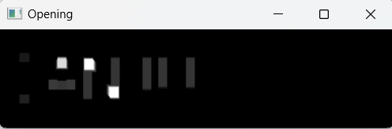

# OPENING-AND-CLOSING
## Aim
To implement Opening and Closing using Python and OpenCV.

## Software Required
1. Anaconda - Python 3.7
2. OpenCV
## Algorithm:
### Step1:
Import the necessary packages
### Step2:
Create the Text using cv2.putText
### Step3:
Create the structuring element

### Step4:
Use Opening operation

### Step5:
Use Closing Operation

## Program:
```
Developed by :  Sanjay S
Register No  : 212221243002
```
### Import the necessary packages
```py
import cv2
import numpy as np
```
### Display the input Image 
```py
img=np.zeros((100,400), dtype='uint8')
font=cv2.FONT_HERSHEY_SIMPLEX
cv2.putText(img,'KANISHKAR',(5,70), font,2,(255),5,cv2.LINE_AA)
cv2.imshow('Created image', img)
cv2.waitKey(0)
```
### Create the structured element
```py
struct_ele = np.ones((9, 9), np.uint8)
```
### Display the result of Opening
```py
opening = cv2.morphologyEx(img, cv2.MORPH_OPEN, struct_ele)
cv2.imshow('Opening', opening)
cv2.waitKey(0)
```
### Display the result of Closing
```py
closing = cv2.morphologyEx(img, cv2.MORPH_CLOSE, struct_ele)
cv2.imshow('Closing', closing)
cv2.waitKey(0)
```
## Output:

### Display the input Image


### Display the result of Opening


### Display the result of Closing


## Result
Thus the Opening and Closing operation is used in the image using python and OpenCV.
    
